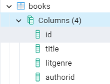

<h1>Лабораторная работа №1</h1>

Выполнили студенты группы 6132-010402D Казаркин Тимофей и Абакумов Леонид

<h2>Задание 1</h2>

1. Установить сервер приложений glassfish

    

2. Запустить сервер

    

3. Открыть административную консоль

    

<h2>Задание 2</h2>

Выбрать и установить СУБД на своё усмотрение

Для использования была выбрана СУБД PostgreSQL

<h2>Задание 3</h2>

1. Выбрать предметную область на своё усмотрение и создать минимум 2 сущности с несколькими параметрами

    В качестве предметной области был выбран "книжный магазин" с 2 сущностями: "авторы" и "книги"

    
    
    

2. Написать скрипт для создания базы данных

[Здесь](src/BookShop.db)

```sql
-- Table: public.authors

-- DROP TABLE IF EXISTS public.authors;

CREATE TABLE IF NOT EXISTS public.authors
(
authorid uuid NOT NULL,
name character varying(50) COLLATE pg_catalog."default",
CONSTRAINT authors_pkey PRIMARY KEY (authorid)
)

TABLESPACE pg_default;

ALTER TABLE IF EXISTS public.authors
OWNER to postgres;

-- Table: public.books

-- DROP TABLE IF EXISTS public.books;

CREATE TABLE IF NOT EXISTS public.books
(
id uuid NOT NULL,
title character varying(50) COLLATE pg_catalog."default",
litgenre character varying(50) COLLATE pg_catalog."default",
authorid uuid,
CONSTRAINT books_pkey PRIMARY KEY (id),
CONSTRAINT books_authorid_fkey FOREIGN KEY (authorid)
REFERENCES public.authors (authorid) MATCH SIMPLE
ON UPDATE NO ACTION
ON DELETE NO ACTION
)

TABLESPACE pg_default;

ALTER TABLE IF EXISTS public.books
OWNER to postgres;
```

<h2>Задание 4</h2>

Разработайте уровень данных в виде JavaBeans для модели и подготовьте их к использованию с EntityPersistence

1. Для авторов:

    [Здесь](src/main/java/com/example/lab1/repositories/AuthorRepository.java)
    и [здесь](src/main/java/com/example/lab1/models/AuthorEntity.java)

2. Для книг:

    [Здесь](src/main/java/com/example/lab1/repositories/BookRepository.java)
    и [здесь](src/main/java/com/example/lab1/models/BookEntity.java)

<h2>Задание 5</h2>

Реализовать бизнес-уровень для доступа к данным с использованием session beans

1. Для авторов [здесь](src/main/java/com/example/lab1/services/AuthorService.java)

2. Для книг [здесь](src/main/java/com/example/lab1/services/BookService.java)

<h2>Задание 6</h2>

Реализуйте слой представления, используя любую технологию по вашему выбору

[Здесь](src/main/webapp/index.jsp)

```angular2html
<%@ page contentType="text/html; charset=UTF-8" pageEncoding="UTF-8" %>
<!DOCTYPE html>
<html>
<head>
    <title>BookShop\(★ω★)/</title>
</head>
<body>
<h1>Welcome to BookShop! Check links below to understand ours products!</h1>
<br/>
<a href="authors">All authors</a>
<br/>
<a href="books">All books</a>
</body>
</html>
```

<h2>Задание 7</h2>

Заставить всё это работать вместе...


