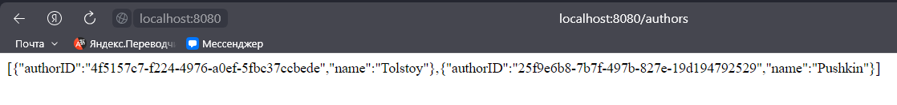

<h1>Лабораторная работа №2</h1>

<h2>Выполнили студенты группы 6132-010402D Казаркин Тимофей и Абакумов Леонид</h2>

<h2>Задание 1</h2>

1. Выберите любую предметную область и создайте модель, содержащую как минимум две сущности с несколькими свойствами

2. Создайте скрипт для создания базы данных для вашей модели

Для выполнения задания были взяты модель и скрип из предыдущей лабораторной работы

[Тык](../lab1/README.md)

<h2>Задание 2</h2>

1. Разработайте слой данных в виде JavaBeans для модели и подготовьте их для использования с Hibernate

    [Для авторов здесь](src/main/java/com/example/lab2/models/AuthorEntity.java)

   [Для книг здесь](src/main/java/com/example/lab2/models/BookEntity.java)

2. Создайте дополнительные классы Hibernate и файлы конфигурации, по мере необходимости

    [Такой необходимости не возникло](README.md)

<h2>Задание 3</h2>

Реализуйте бизнес-уровень с помощью Spring beans

[Для авторов](src/main/java/com/example/lab2/services/AuthorService.java)

[Для книг](src/main/java/com/example/lab2/services/BookService.java)

<h2>Задание 4</h2>

Реализуйте слой представления с помощью Spring MVC

[Для авторов](src/main/java/com/example/lab2/controllers/AuthorController.java)

[Для книг](src/main/java/com/example/lab2/controllers/BookController.java)

<h2>Задание 5</h2>

Сделайте так, чтобы это всё работало вместе...

