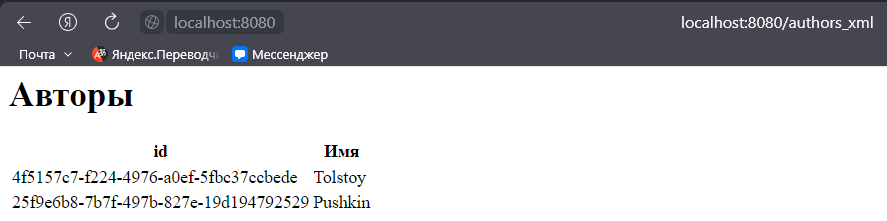

<h1>Лабораторная работа №3</h1>

<h2>Выполнили студенты группы 6132-010402D Казаркин Тимофей и Абакумов Леонид</h2>

<h2>Задание 1</h2>

Сравните JAX-RS и Spring REST. Выберите один из них для вашего приложения. Приведите несколько аргументов в пользу вашего выбора

Был выбран Spring REST. Spring имеет отличную поддержку для разработки веб-сервисов RESTful

<h2>Задание 2</h2>

Выберите одно из ваших предыдущих приложений для дальнейшей разработки.
Разработайте REST API для доступа к вашим данным

1. Было выбрано приложение из двух предыдущих лабораторных работ

2. [Здесь](src/main/java/com/example/lab3/controllers)

<h2>Задание 3</h2>

Реализуйте API.
Он должен позволять использовать как XML, так и JSON

[XML](src/main/java/com/example/lab3/controllers/WebController.java)

[JSON Авторы](src/main/java/com/example/lab3/controllers/AuthorController.java)

[JSON Книги](src/main/java/com/example/lab3/controllers/BookController.java)

<h2>Задание 4</h2>

Разработайте XSL-преобразование для ваших XML-объектов, чтобы браузер мог отображать их в виде HTML-страниц (включая данные объектов и навигацию к другим объектам и их спискам)

[Здесь](src/main/java/com/example/lab3/utils/ObjectToDomTransformer.java)

<h2>Задание 5</h2>

Добавьте XSLT ко всем XML-ответам

[Авторы](src/main/resources/xmls/authors.xslt)

[Книги](src/main/resources/xmls/books.xslt)

<h2>Задание 6</h2>

Сделайте так, чтобы это всё работало вместе...

