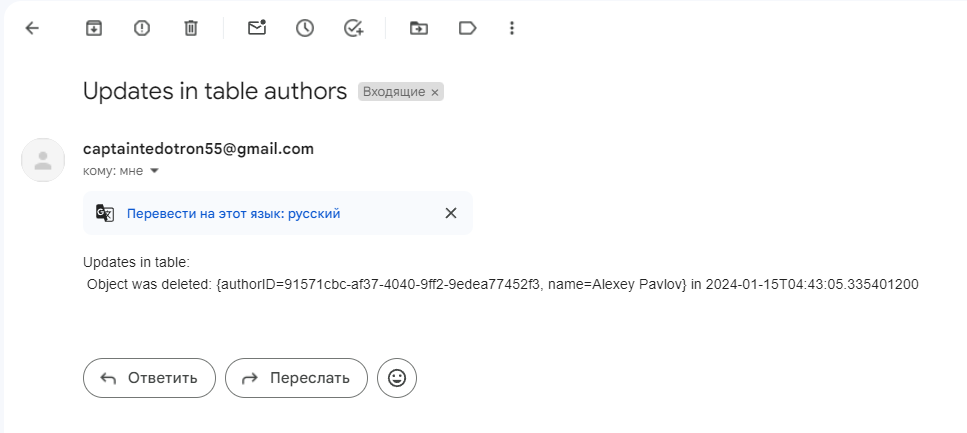
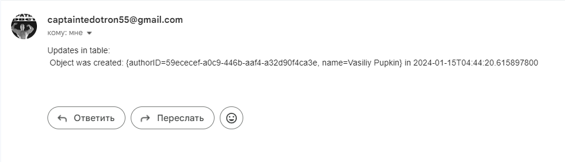
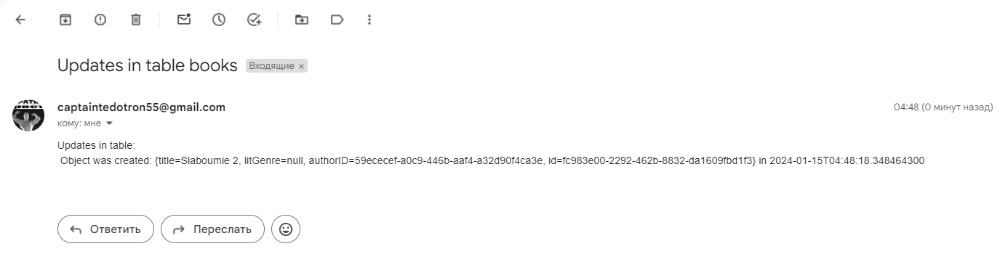
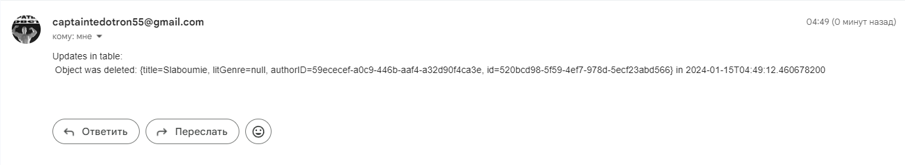

<h1>Лабораторная работа №4</h1>

<h2>Выполнили студенты группы 6132-010402D Казаркин Тимофей и Абакумов Леонид</h2>

<h2>Задание 1</h2>

Add new table to your database. Each row should represent a change of information in other tables of your database. A row should contain information on a kind of a change (insert, update, etc.), on a changing entity (e.g. its class, id) and on a substance of a change (e.g. new values for fields)

```sql
-- Table: public.audit

-- DROP TABLE IF EXISTS public.audit;

CREATE TABLE IF NOT EXISTS public.audit
(
    datetime timestamp(6) without time zone,
    id uuid NOT NULL,
    event character varying(255) COLLATE pg_catalog."default",
    info character varying(255) COLLATE pg_catalog."default",
    tablename character varying(255) COLLATE pg_catalog."default",
    CONSTRAINT audit_pkey PRIMARY KEY (id)
)

TABLESPACE pg_default;

ALTER TABLE IF EXISTS public.audit
    OWNER to postgres;
```

<h2>Задание 2</h2>

Create and configure JMS administrative objects in your application server. Choose type of destination object wisely

[Здесь](src/main/java/com/example/lab4/services/AuditMessageConsumerService.java)

<h2>Задание 3</h2>

Change your application to make it send a message to the destination object every time some changes are applied to entities. Choose message type and structure reasonably

[Здесь](src/main/java/com/example/lab4/services/MailingService.java)

<h2>Задание 4</h2>

Develop MDB or MDP (depending on your technology platform) to receive these messages. Then MDB or MDP should check message’s type and structure, and then make a record into the dedicated table

[Здесь](src/main/java/com/example/lab4/services/AuditProducerService.java)

<h2>Задание 5</h2>

Choose a type of events you want to make notifications for. It can be changes of exact entity, changes of entities with names containing some specific string, some entity attribute exceeding some boundaries, etc. Specify additional information required to identify such an event (e.g. entity id, specific string, attribute boundaries, etc.).
Add new table to the database. Each row should contain an e-mail for notification and condition information

[Здесь](src/main/java/com/example/lab4/models/AuditEvent.java)

```sql
-- Table: public.mailing_rules

-- DROP TABLE IF EXISTS public.mailing_rules;

CREATE TABLE IF NOT EXISTS public.mailing_rules
(
    id uuid NOT NULL,
    email character varying(255) COLLATE pg_catalog."default",
    tablename character varying(255) COLLATE pg_catalog."default",
    CONSTRAINT mailing_rules_pkey PRIMARY KEY (id)
)

TABLESPACE pg_default;

ALTER TABLE IF EXISTS public.mailing_rules
    OWNER to postgres;
```

<h2>Задание 6</h2>

Develop MDB or MDP to receive messages on changes, check conditions and send e-mails.
Some additional class may be required

[Здесь](src/main/java/com/example/lab4/services/AuditMailConsumerService.java)

<h2>Задание 7</h2>

Make everything work together…




